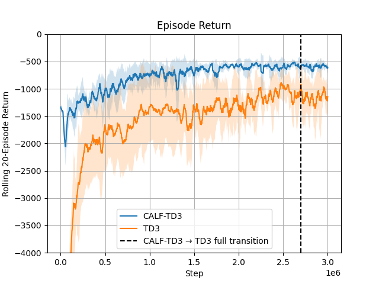

# CALFQ-TD3


## Overview

This repository implements CALFQ-TD3, a novel reinforcement learning algorithm that combines Critic as Lyapunov Function approach and Twin Delayed Deep Deterministic Policy Gradient (TD3). The project focuses on training agents to control an underwater drone environment.



## Features

- Implementation of CALFQ-TD3 algorithm
- Underwater drone simulation environment
- Training and evaluation scripts
- Video generation and analysis tools
- MLflow integration for experiment tracking

## Requirements

- Python >= 3.13
- PyTorch >= 2.6.0
- Stable-Baselines3 == 2.0.0
- Additional dependencies listed in `pyproject.toml`

## Installation

1. Clone the repository:
```bash
git clone https://github.com/yourusername/calfq-td3.git
cd calfq-td3
```

2. Install uv:
```bash
curl -LsSf https://astral.sh/uv/install.sh | sh
```

## Usage

### Training

To train the agent using CALFQ-TD3:
```bash
bash run/train_calfq_5seeds.sh
```

To train using standard TD3:
```bash
bash run/train_td3_5seeds.sh
```


## Project Structure

```
calfq-td3/
├── src/
│   ├── envs/
│   │   └── underwaterdrone.py  # Underwater drone environment
│   ├── utils/                  # Utility functions
│   └── controller.py          # Controller implementation
├── run/
│   ├── train_calfq.py         # CALFQ-TD3 training script
│   ├── train_td3.py           # TD3 training script
│   ├── eval_nominal.py        # Evaluation script
│   └── json_to_video.py       # Video generation script
├── gfx/                       # Graphics and visualization
└── pyproject.toml            # Project dependencies
```

## License

Copyright (c) 2025 aidagroup

Permission is hereby granted, free of charge, to any person obtaining a copy of this software and associated documentation files (the "Software"), to deal in the Software without restriction, including without limitation the rights to use, copy, modify, merge, publish, distribute, sublicense, and/or sell copies of the Software, and to permit persons to whom the Software is furnished to do so, subject to the following conditions:

The above copyright notice and this permission notice shall be included in all copies or substantial portions of the Software.

THE SOFTWARE IS PROVIDED "AS IS", WITHOUT WARRANTY OF ANY KIND, EXPRESS OR IMPLIED, INCLUDING BUT NOT LIMITED TO THE WARRANTIES OF MERCHANTABILITY, FITNESS FOR A PARTICULAR PURPOSE AND NONINFRINGEMENT. IN NO EVENT SHALL THE AUTHORS OR COPYRIGHT HOLDERS BE LIABLE FOR ANY CLAIM, DAMAGES OR OTHER LIABILITY, WHETHER IN AN ACTION OF CONTRACT, TORT OR OTHERWISE, ARISING FROM, OUT OF OR IN CONNECTION WITH THE SOFTWARE OR THE USE OR OTHER DEALINGS IN THE SOFTWARE.
