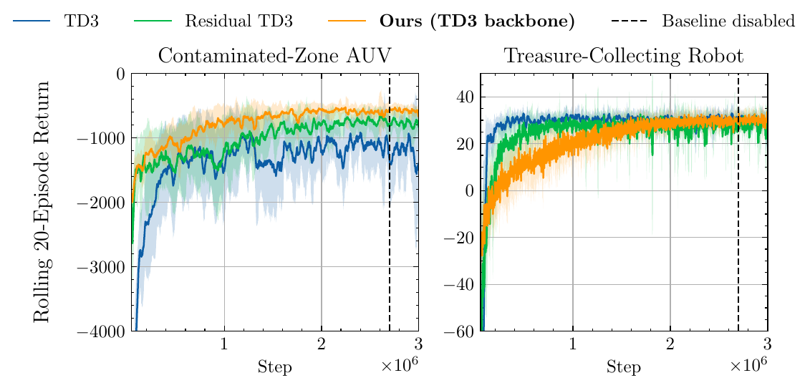
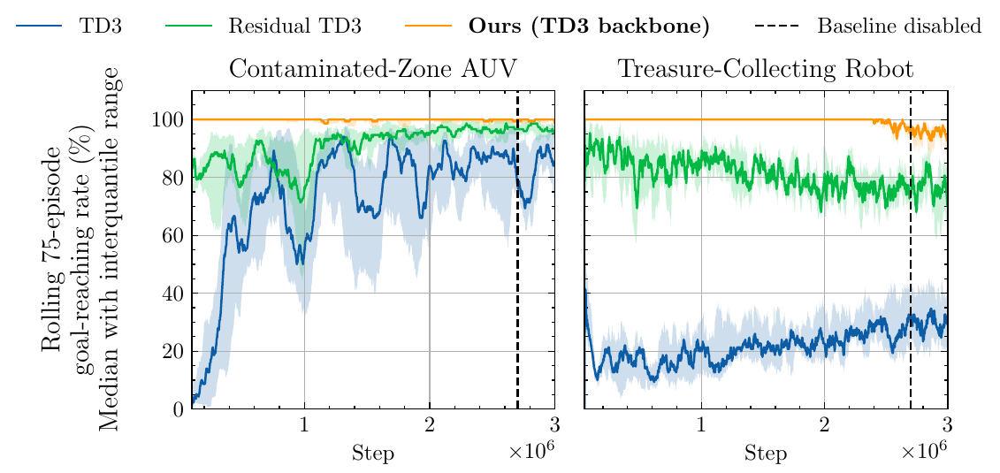
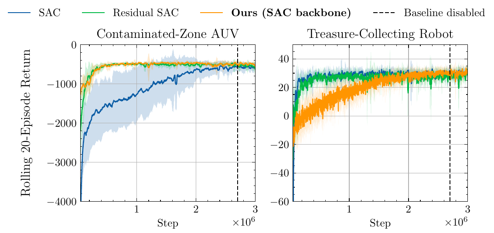
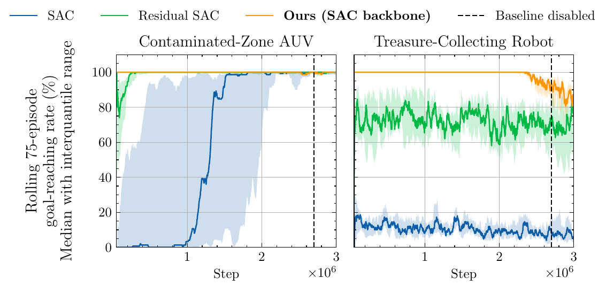

# An Agency-Transferring Model-Free Policy Enhancement Technique

This repository contains the experiment code for reproducing the results of
the paper "An Agency-Transferring Model-Free Policy Enhancement Technique".


## Reproducing Experiments

The project is run through `uv` with Python 3.13.2. Install the interpreter
and synchronize the locked Python environment:

```bash
uv python install 3.13.2
uv sync --frozen
```

Experiments are tracked with MLflow. The tracking stack is required for every
training run: the code logs metrics, artifacts, trajectories, and the current
git commit to MLflow. The local MLflow, PostgreSQL, and MinIO services are
described in `docker-compose.yaml`.

Create a local environment file and start the Docker services before launching
training:

```bash
cp .env.example .env
docker compose up -d
```

The default `.env.example` points the training code to `localhost` and exposes
MLflow on port `5000`, MinIO on port `9010`, and uses `run/logs` as the
artifact staging directory.

TD3-family runs are split by environment and method. Each script launches only
one batch, so run the standard backbone, residual RL, and proposed method
explicitly:

```bash
GPUS=0,1 ./scripts/auv/td3/run_td3.sh
GPUS=0,1 ./scripts/auv/td3/run_residual_rl.sh
GPUS=0,1 ./scripts/auv/td3/run_proposed.sh

GPUS=0,1 ./scripts/robot/td3/run_td3.sh
GPUS=0,1 ./scripts/robot/td3/run_residual_rl.sh
GPUS=0,1 ./scripts/robot/td3/run_proposed.sh
```

SAC-family runs use the same structure:

```bash
GPUS=0,1 ./scripts/auv/sac/run_sac.sh
GPUS=0,1 ./scripts/auv/sac/run_residual_rl.sh
GPUS=0,1 ./scripts/auv/sac/run_proposed.sh

GPUS=0,1 ./scripts/robot/sac/run_sac.sh
GPUS=0,1 ./scripts/robot/sac/run_residual_rl.sh
GPUS=0,1 ./scripts/robot/sac/run_proposed.sh
```

These scripts run for 3M environment steps by default. The proposed-approach
runs use the final CALF hyperparameters: `p_0=0.9`, `lambda_0=0.96`,
`calfq_anneal_frac=0.9`, and `calfq_critic_improvement_threshold=0.01`.

The CALF-TD3 UnderwaterDrone ablation and relaxation-schedule sensitivity
studies are launched separately:

```bash
GPUS=0,1 ./scripts/ablation_and_sensitivity/run_calfq_td3_drone_ablation.sh
```

This reproduces the published TD3-drone schedules `af015`, `af040`, `af065`,
and `pr10_d09995` with the hyperparameters used in the ablation study.

The CALF-SAC robot relaxation-schedule sensitivity study is launched with:

```bash
GPUS=0,1 ./scripts/ablation_and_sensitivity/run_calfq_sac_robot_sensitivity.sh
```

This compares the default schedule `p_0=0.9`, `lambda_0=0.96` against the
higher-trust schedule `p_0=0.8`, `lambda_0=0.995` using the same SAC
hyperparameters as the main robot runs.

All launch scripts create one `tmux` session per run and write terminal logs
to `run/logs/`. To inspect generated commands without starting training, add
`DRY_RUN=1`, for example:

```bash
DRY_RUN=1 GPUS=0,1 ./scripts/auv/td3/run_proposed.sh
```

See `scripts/README.md` for the full launcher layout and execution controls.

## Reproducing Paper Figures

The plotting workflow and the CSV snapshots used for the submitted SCL figures
are copied into `plotting/`. Regenerate all article figures with:

```bash
cd plotting
uv run python -m calf_plotting --output-dir ../gfx
```

This uses the repository `uv` environment and the data roots under
`plotting/expdata/`. The same package also contains the code for rebuilding
the final metrics tables and the plotting scripts used for the ablation and
sensitivity figures.

## Repository Structure

The repository is organized around three main directories:

- `src/` contains reusable source code: custom environments, baseline
  controllers, configuration, MLflow tracking utilities, metrics collection,
  and asynchronous artifact uploading.
- `run/` contains only the executable Python entrypoints needed to reproduce
  the main TD3/SAC experiments. The training files are intentionally kept as
  standalone scripts in the CleanRL style.
- `scripts/` contains ready-to-run bash launchers for reproducing the main
  experiments and the paper ablation/sensitivity studies. Launchers are grouped
  by environment and backbone; each concrete script starts only one method
  batch, creates one `tmux` session per seed, and distributes runs over the
  GPUs listed in `GPUS`.
- `plotting/` contains the figure-generation package and CSV snapshots
  used to reproduce the SCL submission figures and final metrics tables.

The TD3 and SAC training entrypoints use CleanRL implementations as the
starting point and adapt them to this project by adding custom environments,
MLflow experiment tracking, trajectory/artifact logging, residual RL variants,
and the proposed policy-enhancement logic.

Main training entrypoints:

- `run/train_td3.py`: TD3 backbone adapted from CleanRL TD3, with project
  environments, MLflow logging, metrics, and trajectory artifacts.
- `run/train_td3_residual.py`: residual RL variant of TD3; the learning policy
  outputs residual actions on top of the baseline controller.
- `run/train_calfq.py`: proposed policy-enhancement method on top of TD3; it
  gates between the learning policy and the baseline policy using critic
  improvement and relaxation-schedule logic.
- `run/train_sac.py`: SAC backbone adapted from CleanRL SAC, with the same
  project tracking and artifact conventions.
- `run/train_sac_residual.py`: residual RL variant of SAC.
- `run/train_sac_calfq.py`: proposed policy-enhancement method on top of SAC.

## Results

Main TD3-backbone result figures from the paper:




Main SAC-backbone result figures from the paper:



