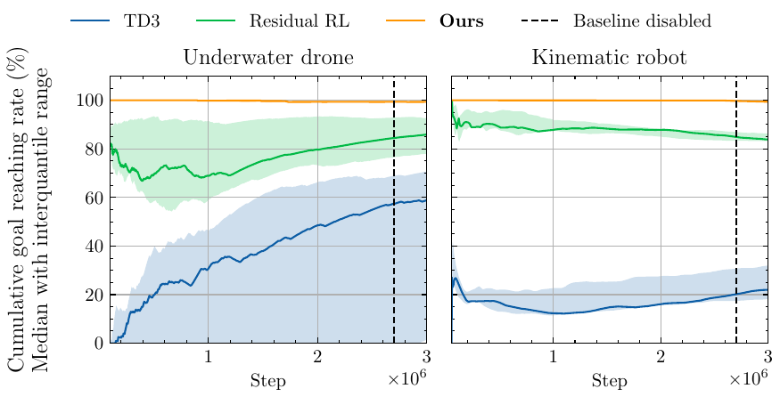
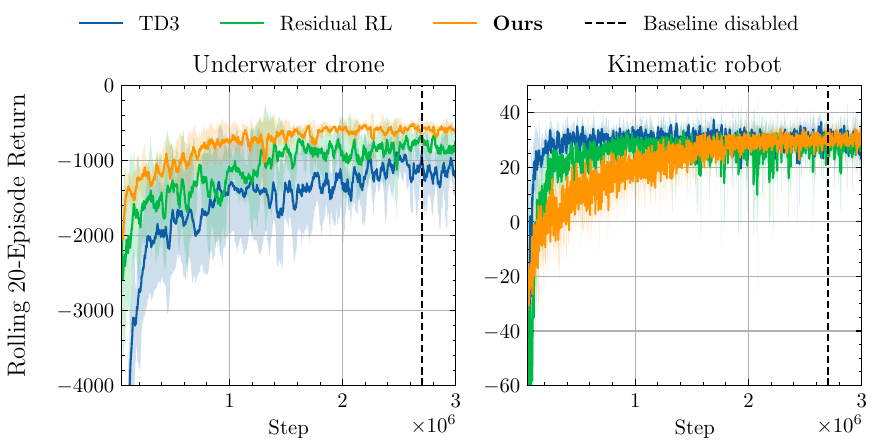

# An Agency-Transferring Model-Free Policy Enhancement Technique


## Reproducing Experiments

The project is run through `uv` with Python 3.13.2. Install the interpreter
and synchronize the locked Python environment:

```bash
uv python install 3.13.2
uv sync --frozen
```

Experiments are tracked with MLflow. The tracking stack is required for every
training run: the code logs metrics, artifacts, trajectories, and the current
git commit to MLflow. The local MLflow, PostgreSQL, and MinIO services are
described in `docker-compose.yaml`.

Create a local environment file and start the Docker services before launching
training:

```bash
cp .env.example .env
docker compose up -d
```

The default `.env.example` points the training code to `localhost` and exposes
MLflow on port `5000`, MinIO on port `9010`, and uses `run/logs` as the
artifact staging directory.

TD3-family runs are split by environment:

```bash
GPUS=0,1 ./scripts/run_td3_drone.sh
GPUS=0,1 ./scripts/run_td3_robot.sh
```

SAC-family runs are also split by environment:

```bash
GPUS=0,1 ./scripts/run_sac_drone.sh
GPUS=0,1 ./scripts/run_sac_robot.sh
```

These scripts launch the standard backbone, residual RL, and the proposed
approach for 3M environment steps. The proposed-approach runs use the final
CALF hyperparameters: `p_0=0.9`, `lambda_0=0.96`,
`calfq_anneal_frac=0.9`, `calfq_critic_improvement_threshold=0.01`, and
disabled selective buffering.

The CALF-TD3 UnderwaterDrone ablation and relaxation-schedule sensitivity
studies are launched separately:

```bash
GPUS=0,1 ./scripts/run_calfq_td3_drone_ablation.sh
```

This reproduces the published TD3-drone schedules `af015`, `af040`, `af065`,
and `pr10_d09995` with the hyperparameters used in the ablation study.

The CALF-SAC robot relaxation-schedule sensitivity study is launched with:

```bash
GPUS=0,1 ./scripts/run_calfq_sac_robot_sensitivity.sh
```

This compares the default schedule `p_0=0.9`, `lambda_0=0.96` against the
higher-trust schedule `p_0=0.8`, `lambda_0=0.995` using the same SAC
hyperparameters as the main robot runs.

All launch scripts create one `tmux` session per run and write terminal logs
to `run/logs/`. To inspect generated commands without starting training, add
`DRY_RUN=1`, for example:

```bash
DRY_RUN=1 GPUS=0,1 ./scripts/run_td3_drone.sh
```

## Results




