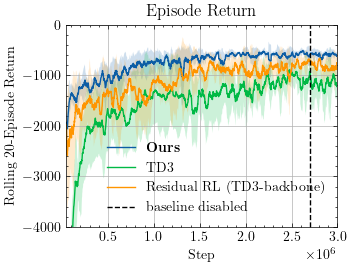

# A Lyapunov-based Model-Free Policy Enhancement Technique


A Lyapunov-based model-free policy enhancement technique for reinforcement learning, demonstrated on the UnderwaterDrone-v0 environment.


<div align="center">
  
</div>

## Quick Start

### Installation

```bash
git clone https://github.com/aidagroup/calf-enhance.git
cd calf-enhance
curl -LsSf https://astral.sh/uv/install.sh | sh
uv sync
```

### Running Experiments

Train with CALF-TD3 enhancement (5 seeds):
```bash
bash reproduce/train_calf_enhance_5seeds.sh
```

Train with standard TD3 (5 seeds):
```bash
bash reproduce/train_td3_5seeds.sh
```

Train with residual RL + TD3 (5 seeds):
```bash
bash reproduce/train_td3_residual_5seeds.sh
```

### View Results

```bash
mlflow ui
```

## Repository Structure

```
├── src/                    # Source code
│   ├── controller.py       # Main controller logic
│   ├── envs/              # Environment implementations  
│   └── utils/             # Utility functions
├── run/                   # Training scripts
│   ├── train_calf_enhance.py  # Our algo training
│   ├── train_td3.py          # Standard TD3 training
│   ├── train_td3_residual.py # Residual RL training
│   └── eval_nominal.py       # Evaluation script
├── reproduce/             # Reproduction scripts
└── gfx/                  # Images and demos
```

## Requirements

- Python ≥3.13
- PyTorch, stable-baselines3, MLflow
- See `pyproject.toml` for full dependencies

## License

MIT License - See `LICENCE` file for details.
